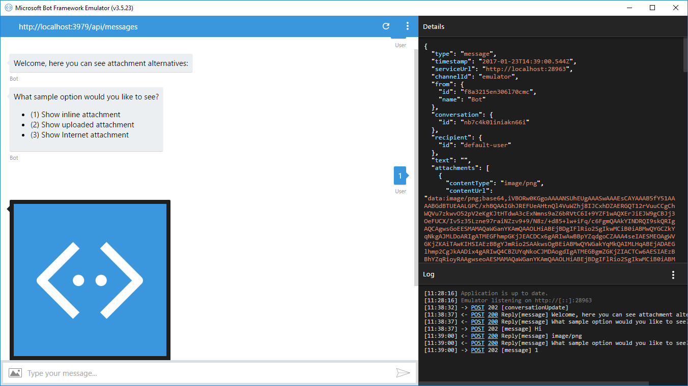
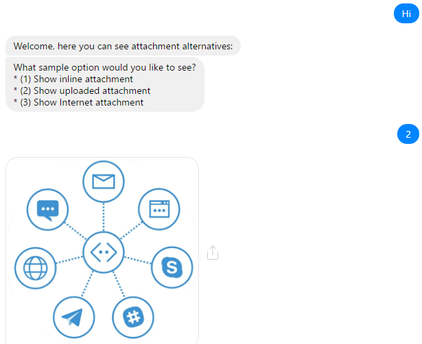
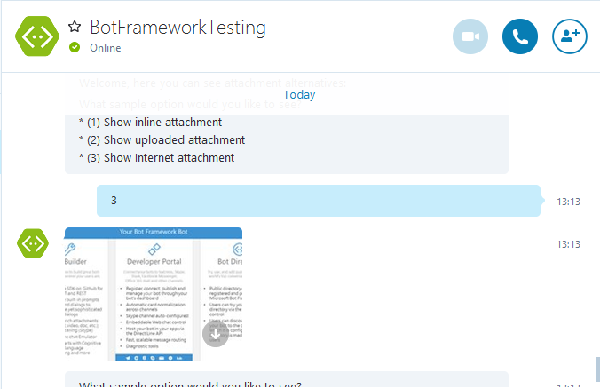

# Send Attachment Bot Sample

A sample bot that passes simple media attachments (images) to a user activity.

[![Deploy to Azure][Deploy Button]][Deploy CSharp/SendAttachment]
[Deploy Button]: https://azuredeploy.net/deploybutton.png
[Deploy CSharp/SendAttachment]: https://azuredeploy.net

### Prerequisites

The minimum prerequisites to run this sample are:
* The latest update of Visual Studio 2015. You can download the community version [here](http://www.visualstudio.com) for free.
* The Bot Framework Emulator. To install the Bot Framework Emulator, download it from [here](https://emulator.botframework.com/). Please refer to [this documentation article](https://github.com/microsoft/botframework-emulator/wiki/Getting-Started) to know more about the Bot Framework Emulator.

### Code Highlights

Many messaging channels provide the ability to attach richer objects. To pass a simple media attachment (image/audio/video/file) to an activity you add a simple attachment data structure with a link to the content, setting the ContentType, ContentUrl and Name properties.
The Attachments property is an array of Attachment objects which allow you to send and receive images and other content. Check out the key code located in the [SendAttachmentDialog](SendAttachmentDialog.cs#L57-L84) class where the `replyMessage.Attachments` property of the message activity is populated with an image attachment.

````C#
public async Task ProcessSelectedOptionAsync(IDialogContext context, IAwaitable<string> argument)
{
    var message = await argument;

    var replyMessage = context.MakeMessage();

    Attachment attachment = null;

    switch (message)
    {
        case "1":
            attachment = GetInlineAttachment();
            break;
        case "2":
            attachment = await GetUploadedAttachmentAsync(replyMessage.ServiceUrl, replyMessage.Conversation.Id);
            break;
        case "3":
            attachment = GetInternetAttachment();
            break;
    }

    // The Attachments property allows you to send and receive images and other content
    replyMessage.Attachments = new List<Attachment> { attachment };

    await context.PostAsync(replyMessage);

    await this.DisplayOptionsAsync(context, null);
}
````

As a developer, you have three ways to send the attachment. The attachment can be:
 - An inline file, by encoding the file as base64 and use it in the contentUrl
 - A file uploaded to the channel's store via the Connection API, then using the attachmentId to create the contentUrl
 - An externally hosted file, by just specifying the Url of the file (it should be publicly accessible)

#### Attaching the image inline

It consists on sending the file contents, encoded in base64, along with the message payload. This option works for small files, like icon size images. 
You'll need to encode file's content, then set the attachment's `contentUrl` as follows:

````
data:image/png;base64,iVBORw0KGgo…
````

Checkout [GetInlineAttachmentInfo](SendAttachmentDialog.cs#L86-L98) to see how to convert a file read from filesystem and return the required information to create the message attachment in the key method shown above (ProcessSelectedOptionAsync).

````C#
private static Attachment GetInlineAttachment()
{
    var imagePath = HttpContext.Current.Server.MapPath("~/images/small-image.png");

    var imageData = Convert.ToBase64String(File.ReadAllBytes(imagePath));

    return new Attachment
    {
        Name = "small-image.png",
        ContentType = "image/png",
        ContentUrl = $"data:image/png;base64,{imageData}"
    };
}
````

#### Uploading the file via the Connector API

This option should be used when the file to send is less than 256Kb in size when encoded to base64. A good scenario are images generated based on user input.

Checkout [GetUploadedAttachmentInfoAsync](SendAttachmentDialog.cs#L100-L129) to see how to get the required information to create the message attachment in the key method shown above (ProcessSelectedOptionAsync).

It does require a few more steps than the other methods, but leverages the channels store to store the file:

0. Get an instance to the Connector API which will handle communication with channel storage ([relevant code](SendAttachmentDialog.cs#L104))
1. Create a new attachments set providing the Connector API instance as argument ([relevant code](SendAttachmentDialog.cs#L106))
2. Read (or generate) the content file and store it in a Byte array to use it as argument within the AttachmentData members ([relevant code](SendAttachmentDialog.cs#L112))
3. Perform the attachment upload to the channel ([relevant code](SendAttachmentDialog.cs#L107))
4. Get the attachment Uri (using the uploaded Id) where the channel stored the uploaded image ([relevant code](SendAttachmentDialog.cs#L116))

````C#
private static async Task<Attachment> GetUploadedAttachmentAsync(string serviceUrl, string conversationId)
{
    var imagePath = HttpContext.Current.Server.MapPath("~/images/big-image.png");

    using (var connector = new ConnectorClient(new Uri(serviceUrl)))
    {
        var attachments = new Attachments(connector);
        var response = await attachments.Client.Conversations.UploadAttachmentAsync(
            conversationId,
            new AttachmentData
            {
                Name = "big-image.png",
                OriginalBase64 = File.ReadAllBytes(imagePath),
                Type = "image/png"
            });

        var attachmentUri = attachments.GetAttachmentUri(response.Id);

        // Typo bug in current assembly version '.Replace("{vieWId}", Uri.EscapeDataString(viewId))'.
        // TODO: remove this line when replacement Bug is fixed on future releases. PR: https://github.com/Microsoft/BotBuilder/pull/2079
        attachmentUri = attachmentUri.Replace("{viewId}", "original");

        return new Attachment
        {
            Name = "big-image.png",
            ContentType = "image/png",
            ContentUrl = attachmentUri
        };
    }
}
````

#### Using an externally hosted file

This option is the simplest but requires the image to be already on the Internet and be publicly accesible.
You could also provide an Url pointing to your own site.

Checkout [GetInternetAttachmentInfo](SendAttachmentDialog.cs#L131-L139) to see how to get the required information to create the message attachment in the key method shown above (ProcessSelectedOptionAsync).

````C#
private static Attachment GetInternetAttachment()
{
    return new Attachment
    {
        Name = "BotFrameworkOverview.png",
        ContentType = "image/png",
        ContentUrl = "https://docs.botframework.com/en-us/images/faq-overview/botframework_overview_july.png"
    };
}
````

### Outcome

You will see the following in the Bot Framework Emulator when opening and running the sample solution.



You will see the following in your Facebook Messenger.



On the other hand, you will see the following in Skype.



### More Information

To get more information about how to get started in Bot Builder for .NET and Attachments please review the following resources:
* [Bot Builder for .NET](https://docs.botframework.com/en-us/csharp/builder/sdkreference/index.html)
* [Adding Attachments to a Message](https://docs.botframework.com/en-us/core-concepts/attachments)
* [Attachments Property](https://docs.botframework.com/en-us/csharp/builder/sdkreference/activities.html#attachmentsproperty)
* [Attachments, Cards and Actions](https://docs.botframework.com/en-us/csharp/builder/sdkreference/attachments.html)
